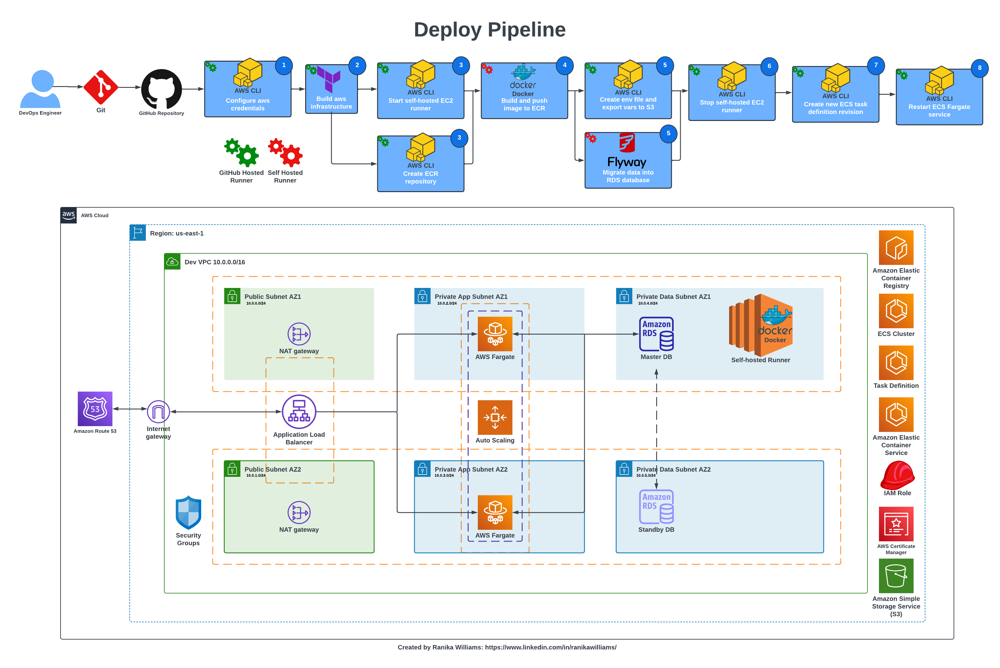

# Deploy Dynamic Web Apps on AWS using CI/CD Pipelines and GitHub Actions

## Project Overview
This project showcases the deployment of a dynamic web application on AWS using Terraform for infrastructure as code and GitHub Actions for continuous integration and deployment (CI/CD). The deployment process involves building and pushing Docker images, managing AWS resources, and automating tasks to ensure a seamless deployment experience. The architecture of this deployment includes the following components:

- **Amazon ECR**: To store Docker images.
- **Amazon ECS Fargate**: To run the containerized application.
- **Amazon RDS**: For the relational database.
- **Amazon S3**: To store environment files.
- **Terraform**: To define and provision the infrastructure.
- **GitHub Actions**: To automate the CI/CD pipeline.
- **CI/CD Pipelines**: To build and manage continuous integration and deployment pipelines to ensure smooth and efficient application updates.
- **Docker**: To containerize the application for consistent and portable deployment.
- **Linux & Bash Scripting**: Automate and manage development environment and deployment processes with Linux commands and Bash scripts.
- **Flyway**: Seamlessly manage database migrations to ensure data evolves with the application.
- **Credential Management**: Securely manage secrets and credentials with AWS Secrets Manager and GitHub Actions repository secrets.

## Architectural Diagram:

## Learning Outcomes:
During this project, I gained valuable insights and experience in several areas:

- Terraform for Infrastructure as Code: Learned how to define, provision, and manage AWS infrastructure using Terraform.
- CI/CD with GitHub Actions: Developed a CI/CD pipeline to automate the build, test, and deployment processes.
- Containerization with Docker: Gained proficiency in building, managing, and deploying Docker containers.
- AWS Services Integration: Integrated various AWS services like ECS, ECR, RDS, and S3 to create a cohesive deployment strategy.
- Database Migration with Flyway: Automated database migrations using Flyway, ensuring consistency and reliability.
- Security and Compliance: Ensured secure handling of credentials and configurations by leveraging AWS IAM roles and policies.

